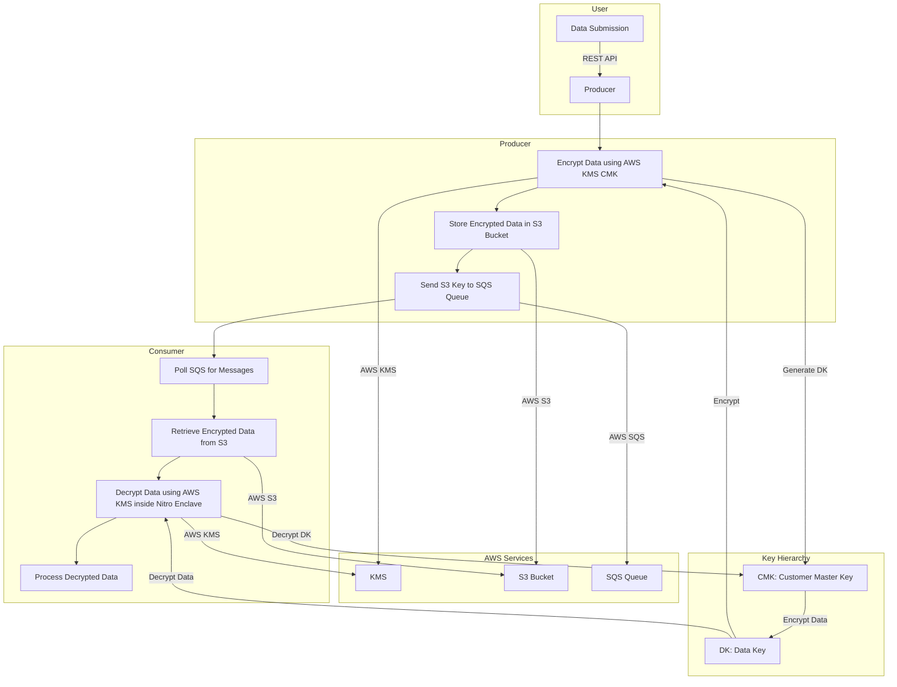

## Overview
This project is part of a secure data processing architecture that utilizes AWS services and Nitro Enclaves to handle AI/ML data securely. The architecture includes a producer component that encrypts data and sends it to a consumer component for processing within a Nitro Enclave. The processing activity could be an inference or model training. 

## Architecture
### Components
#### Producer Crypto Agent:
A Node.js application that accepts data through an API call, encrypts the data using AWS KMS, stores the encrypted data in an S3 bucket, and sends a job message to an SQS queue.
Services Used: AWS KMS, AWS S3, AWS SQS
#### Consumer Crypto Agent:
A Node.js application running inside a Nitro Enclave that polls the SQS queue for jobs, decrypts the data using AWS KMS inside the Nitro Enclave, processes the data, and optionally stores or further processes the results.
Services Used: AWS KMS, AWS SQS, AWS Nitro Enclaves


#### Data Flow
1. Data Submission:
The producer accepts data through a REST API endpoint (/encrypt).
2. Data Encryption:
The producer encrypts the data using AWS KMS with a customer master key (CMK).
3. Data Storage:
The encrypted data is stored in an S3 bucket.
4. Job Queue:
A message containing the S3 key of the encrypted data is sent to an SQS queue.
5. Job Polling:
The consumer polls the SQS queue for new messages.
6. Data Decryption:
The consumer retrieves the encrypted data from S3, decrypts it using AWS KMS inside the 
7. Nitro Enclave.
7.1 Data Processing: The decrypted data is processed by the consumer.

## Security Benefits
#### Data Encryption: 
Using AWS KMS ensures that data is encrypted with robust encryption keys managed by AWS an by using AWS Nitro Enclaves it provides an isolated execution environment for processing sensitive data, ensuring that the data remains secure and isolated from the host system.

#### Controlled Access: 
Access to encryption keys and other sensitive resources is strictly controlled and audited using AWS IAM policies and AWS KMS.

## Detailed Use of AWS KMS
### Encryption Key (CMK):
#### Stage: Data Encryption
Description: A customer master key (CMK) in AWS KMS is used by the producer to encrypt data before storing it in S3.
#### Stage: Data Decryption
Description: The encrypted data key is decrypted inside the Nitro Enclave using the CMK to get the plaintext data key, which is then used to decrypt the actual data.

## IAM Policy
### Principles Least Privilege: 
Grant the minimum permissions necessary for each component to perform its tasks.

### Separation of Duties: 
Ensure that different components (producer and consumer) have distinct roles and policies to prevent unauthorized access.

### Trust Boundaries: 
The consumer host is not trusted, and only the Nitro Enclave is trusted to handle sensitive data.

### Producer Crypto Agent IAM Policy
The producer needs permissions to:
1. Encrypt data using the KMS key.
2. Put objects in the S3 bucket.
3. Send messages to the SQS queue.

#### Example IAM policy for the producer:
```json
{
  "Version": "2012-10-17",
  "Statement": [
    {
      "Effect": "Allow",
      "Action": [
        "kms:Encrypt"
      ],
      "Resource": "arn:aws:kms:us-west-2:your-account-id:key/your-kms-key-id"
    },
    {
      "Effect": "Allow",
      "Action": [
        "s3:PutObject"
      ],
      "Resource": "arn:aws:s3:::your-s3-bucket/*"
    },
    {
      "Effect": "Allow",
      "Action": [
        "sqs:SendMessage"
      ],
      "Resource": "arn:aws:sqs:us-west-2:your-account-id:your-sqs-queue"
    }
  ]
}
```

### Consumer Crypto Agent IAM Policy
The consumer Nitro Enclave needs permissions to:
1. Decrypt data using the KMS key.
2. Get objects from the S3 bucket.
3. Delete messages from the SQS queue.

To ensure the host is not trusted, the IAM role assigned to the EC2 instance should have the following conditions:
1. Allow Nitro Enclave to assume the role.
2. Restrict KMS decryption to requests from the Nitro Enclave.

#### Example IAM policy for the consumer Nitro Enclave:
```json
{
  "Version": "2012-10-17",
  "Statement": [
    {
      "Effect": "Allow",
      "Action": [
        "kms:Decrypt"
      ],
      "Resource": "arn:aws:kms:us-west-2:your-account-id:key/your-kms-key-id",
      "Condition": {
        "StringEquals": {
          "aws:RequestContext": "aws:EnclaveID"
        }
      }
    },
    {
      "Effect": "Allow",
      "Action": [
        "s3:GetObject"
      ],
      "Resource": "arn:aws:s3:::your-s3-bucket/*"
    },
    {
      "Effect": "Allow",
      "Action": [
        "sqs:ReceiveMessage",
        "sqs:DeleteMessage",
        "sqs:ChangeMessageVisibility"
      ],
      "Resource": "arn:aws:sqs:us-west-2:your-account-id:your-sqs-queue"
    }
  ]
}
```

### IAM Role for Nitro Enclave
The IAM role attached to the EC2 instance must allow Nitro Enclave to assume the role and should be restrictive about the actions that can be performed from the host. Use the aws:RequestContext condition key to enforce these restrictions.
#### Example IAM role trust policy:
```json
{
  "Version": "2012-10-17",
  "Statement": [
    {
      "Effect": "Allow",
      "Principal": {
        "Service": "ec2.amazonaws.com"
      },
      "Action": "sts:AssumeRole"
    },
    {
      "Effect": "Allow",
      "Principal": {
        "Service": "ec2.amazonaws.com",
        "Condition": {
          "StringEquals": {
            "aws:RequestContext": "aws:EnclaveID"
          }
        }
      },
      "Action": "sts:AssumeRole"
    }
  ]
}
```

# Building and Running
## Prerequisites
1. AWS account with necessary permissions for KMS, S3, SQS, and EC2.
2. Terraform installed on your local machine.
4. SSH key pair for accessing EC2 instances.

## Setup Steps
1. Terraform Configuration:
Update the terraform.tfvars file with your specific configuration such as AWS region, S3 bucket name, SQS queue URL, and KMS key ID.
2. Initialize Terraform:
3. Apply Terraform configuration:

 

##  Detailed Explanation of the Scripts
### Producer Crypto Agent (app.js)
#### Configuration:
Loads AWS SDK and initializes S3, SQS, and KMS clients. Reads configuration from config.json.
#### API Endpoint:
The `/encrypt` endpoint accepts data, encrypts it using AWS KMS, stores it in S3, and sends a message to SQS.

#### Functions:
`encryptData(data)`: Encrypts data using AWS KMS.
`storeInS3(encryptedData)`: Stores encrypted data in S3.
`sendJobToSQS(s3Key)`: Sends a job message to SQS with the S3 key of the encrypted data.

### Consumer Crypto Agent (poll.js)
#### Configuration:
Initializes AWS SDK clients for SQS and KMS.

#### Polling Function:
`pollQueue()`: Polls the SQS queue for messages, decrypts the messages using AWS KMS, processes the decrypted data, and deletes the message from the queue.
#### Functions:
`decryptMessage(encryptedMessage)`: Decrypts a message using AWS KMS.
`processData(data)`: Processes the decrypted data by making a POST request to a local endpoint.
`deleteMessage(receiptHandle)`: Deletes a message from the SQS queue.

# Secure Data Processing Flow Chart



# Traceability Matrix  

| **Threat**                                              | **Vulnerability**                                           | **Mitigation**                                                                                       | **Security Control**                                                    | **Control Mitigation Description**                                      | **Risk Rating** | **Likelihood** |
|---------------------------------------------------------|-------------------------------------------------------------|------------------------------------------------------------------------------------------------------|-------------------------------------------------------------------------|-------------------------------------------------------------------------|-----------------|----------------|
| **Data Submission**                                     |                                                             |                                                                                                      |                                                                         |                                                                         |                 |                |
| Data interception during submission                     | Data could be intercepted if not transmitted securely       | Use HTTPS for secure data transmission                                                               | HTTPS/TLS                                                               | Ensures data is encrypted during transmission, preventing interception. | High            | Medium         |
| Unauthorized data submission                            | Malicious users could submit unauthorized data              | Implement strong authentication and authorization mechanisms (e.g., OAuth 2.0)                       | IAM, OAuth 2.0                                                          | Ensures only authenticated and authorized users can submit data.        | High            | Medium         |
| **Data Encryption**                                     |                                                             |                                                                                                      |                                                                         |                                                                         |                 |                |
| Compromise of the KMS Customer Master Key (CMK)         | CMK could be compromised                                    | Use IAM policies to restrict access to the CMK, enable key rotation, monitor key usage with CloudTrail | IAM, KMS Key Rotation, CloudTrail                                       | Limits access to the CMK, reduces the risk of key compromise, and provides audit logs. | Critical        | Low            |
| Weak encryption algorithms                              | Encrypted data could be decrypted if weak algorithms are used | Use strong encryption algorithms and AWS KMS                                                         | KMS, Encryption Algorithms                                              | Ensures data is encrypted with robust algorithms, making decryption by attackers difficult. | Critical        | Low            |
| **Data Storage**                                        |                                                             |                                                                                                      |                                                                         |                                                                         |                 |                |
| Unauthorized access to the S3 bucket                    | Encrypted data could be accessed if S3 bucket policies are not configured correctly | Use S3 bucket policies and IAM roles to restrict access, enable S3 server-side encryption, use VPC endpoints for S3 | IAM, S3 Bucket Policies, Server-Side Encryption, VPC Endpoints          | Restricts access to the bucket, ensures data is encrypted at rest, and secures communication channels. | High            | Medium         |
| Data integrity compromise                               | Data could be altered without detection                     | Enable S3 versioning and use S3 Object Lock for WORM protection                                      | S3 Versioning, S3 Object Lock                                           | Maintains data integrity by keeping versions and preventing unauthorized modifications. | High            | Low            |
| **Job Queue**                                           |                                                             |                                                                                                      |                                                                         |                                                                         |                 |                |
| Unauthorized access to the SQS queue                    | Messages in the SQS queue could be accessed or altered      | Use IAM policies to restrict access to the SQS queue                                                 | IAM, SQS Queue Policies                                                 | Ensures only authorized roles can access and modify messages in the queue. | High            | Medium         |
| **Data Retrieval and Decryption**                       |                                                             |                                                                                                      |                                                                         |                                                                         |                 |                |
| Unauthorized decryption of data                         | Encrypted data could be decrypted by unauthorized parties   | Restrict KMS decryption to Nitro Enclave, use IAM policies with conditions                           | IAM, KMS Policies, Nitro Enclave                                        | Ensures decryption keys are only accessible within the trusted enclave environment. | Critical        | Low            |
| Data interception during retrieval                      | Data could be intercepted during retrieval from S3          | Use VPC endpoints for S3                                                                             | VPC Endpoints                                                           | Ensures secure and private communication channels for data retrieval. | High            | Low            |
| **Data Processing**                                     |                                                             |                                                                                                      |                                                                         |                                                                         |                 |                |
| Unauthorized processing                                 | Data could be processed by unauthorized entities            | Use Nitro Enclave for isolated and secure processing                                                 | Nitro Enclave, IAM                                                      | Ensures data processing occurs in a secure and isolated environment, accessible only by trusted entities. | Critical        | Low            |
| Compromise of the Nitro Enclave                         | Nitro Enclave could be compromised                          | Monitor enclave integrity, use secure boot and attestation                                           | Nitro Enclave Attestation, Secure Boot                                  | Ensures the integrity and security of the enclave environment. | Critical        | Low            |
| **AI/ML Model Integrity and Security**                  |                                                             |                                                                                                      |                                                                         |                                                                         |                 |                |
| Model poisoning                                         | AI/ML models could be tampered with during training or inference | Isolate training data and model updates within Nitro Enclave, validate training data integrity         | Nitro Enclave, Data Validation, Model Validation                        | Ensures models and training data are secure and unaltered during the entire lifecycle. | Critical        | Low            |
| Unauthorized access to AI/ML models                     | AI/ML models could be stolen or manipulated                 | Encrypt models at rest and in transit, use IAM policies to control access to model storage            | Encryption, IAM, Access Controls                                        | Ensures models are protected from unauthorized access and manipulation. | High            | Medium         |
| Inferencing with compromised data                       | Inferencing with compromised or malicious data inputs       | Validate and sanitize data inputs before processing                                                  | Data Validation, Input Sanitization                                     | Ensures only clean and validated data is used for inferencing. | High            | Medium         |
| **Model Deployment and Inference**                      |                                                             |                                                                                                      |                                                                         |                                                                         |                 |                |
| Unauthorized model deployment                           | Unauthorized users could deploy malicious models            | Use strong authentication and authorization for model deployment                                     | IAM, Multi-Factor Authentication (MFA)                                  | Ensures only authorized and authenticated users can deploy models. | High            | Medium         |
| Model extraction attacks                                | Attackers could extract the model by querying it            | Implement rate limiting, anomaly detection, and monitor for unusual query patterns                   | Rate Limiting, Anomaly Detection, Monitoring                            | Reduces the risk of model extraction by limiting and monitoring access patterns. | High            | Medium         |

# Summary
This project demonstrates a secure data processing architecture using AWS services and Nitro Enclaves. The producer a AI/ML data owner encrypts and stores sensitive data, while the consumer processes it in an isolated environment. This architecture ensures data security and integrity through encryption and isolated processing.